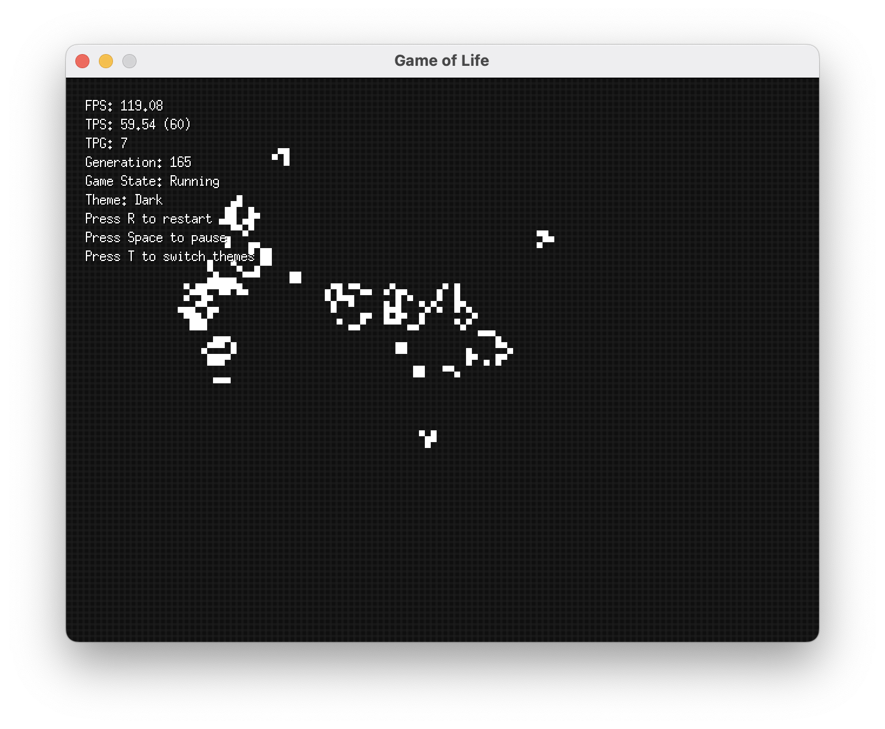

# Conway's Game of Life
> An implementation of Conway's "Game of Life" in Go using [Ebitengine](https://ebitengine.org/).

## Running

1. Pull changes
2. `go mod tidy`
3. `go run main.go`
4. _Éxito_

## But, why?

Reinventing the wheel can be fun, sometimes.

## No, seriously, why?

I'm learning Go and also would like to try game dev as it's a significantly different approach to software than
what I'm used to. Writing a small game using Ebitengine felt like a fun to kill two birds with one stone.